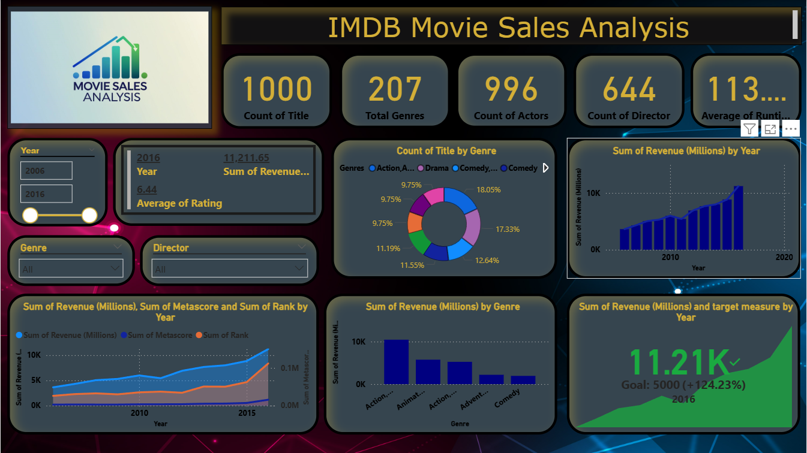

# 🎬 IMDB Movie Sales Analysis (Power BI Dashboard)

## 📊 Project Overview

This project showcases a dynamic Power BI dashboard that analyzes movie sales data from IMDB. It helps uncover insights into revenue generation, genre popularity, and performance over time.

The dashboard provides a clear visual summary of how different movie factors such as genre, rating, and release year impact overall sales.

---

## 🚀 Features

- ✅ Total Titles: 1000 movies analyzed
- ✅ Genre-wise distribution with interactive donut chart
- ✅ Revenue trends over time (2006–2016)
- ✅ Year-wise and Genre-wise Revenue comparison
- ✅ Actor and Director counts
- ✅ KPI Cards for ratings, revenue, runtime, and goals
- ✅ Interactive filters for year, genre, and director

---

## 📂 Files Included

📁 IMDB-Movie-Sales-Analysis  
 ┣ 📄 IMDB_Movie_Sales.pbix  
 ┣ 🖼️ Dashboard Screenshot (.png)  
 ┗ 📄 README.md  

---

## 📈 Key Insights

- Action and Drama are the most common genres.
- Movie revenue has consistently increased, peaking in 2016.
- Average movie rating in 2016 was 6.44, with revenue exceeding 11.2K million.
- Visual comparison of revenue, metascore, and ranking metrics.

---

## 🧰 Tools & Technologies

- Power BI – Dashboard creation and data visualization
- DAX – For KPIs and calculated measures
- Excel / CSV – For dataset input and data cleaning

---

## 📌 Future Enhancements

- Add budget vs. revenue comparison
- Integrate user reviews sentiment analysis
- Extend timeline beyond 2016

---

## 📩 Contact

**Abhishek Goud**  
🔗 LinkedIn: https://www.linkedin.com/in/abhishek-goud-860720251/

---

⭐ If you found this helpful, don't forget to star the repository!
